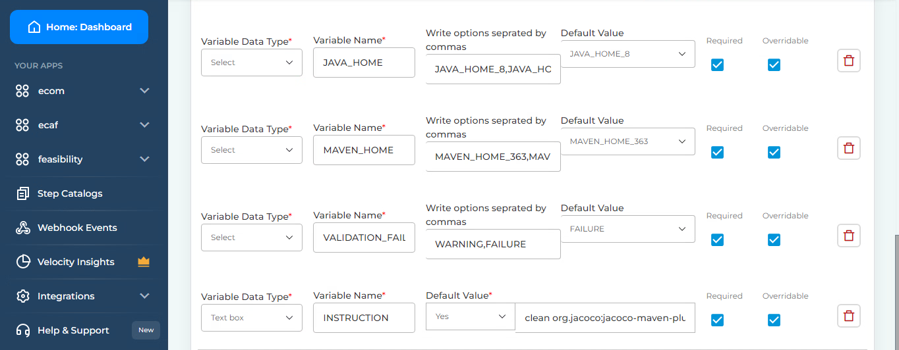

# BP-MAVEN-STEP

I'll use maven to build the java project

## Setup

* Clone the code available at [BP-MAVEN-STEP](https://github.com/OT-BUILDPIPER-MARKETPLACE/BP-MAVEN-STEP)
  ```bash
  git clone git@github.com:OT-BUILDPIPER-MARKETPLACE/BP-MAVEN-STEP.git
  ```
* Build the docker image

```
git submodule init
git submodule update
docker build -t registry.buildpiper.in/maven-execute:multi-jdk-test .
```

* Do local testing via image only

```
# Build code with default settings 
docker run -it --rm -v $PWD:/src -e WORKSPACE=/src -e CODEBASE_DIR=/ registry.buildpiper.in/maven-execute:multi-jdk-test

# Only compile the code
docker run -it --rm -v $PWD:/src -e WORKSPACE=/src -e CODEBASE_DIR=/ -e INSTRUCTION=compile registry.buildpiper.in/maven-execute:multi-jdk-test
```

## ENV Example



```bash
WORKSPACE = /bp/workspace
INSTRUCTION = clean install
MAVEN_HOME = MAVEN_HOME_363,MAVEN_HOME_381,MAVEN_HOME_354
JAVA_HOME = JAVA_HOME_8,JAVA_HOME_11,JAVA_HOME_17
VALIDATON_FAILURE_ACTION = WARNING,FAILURE
```
