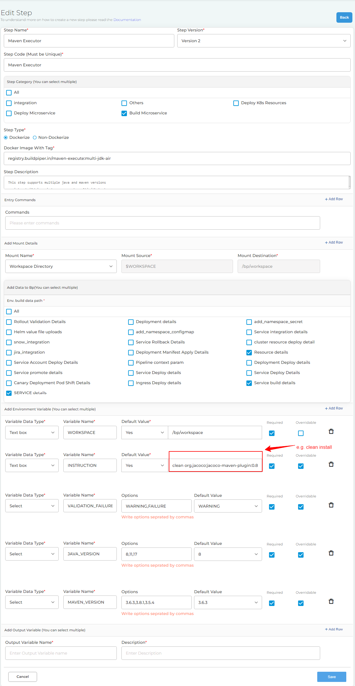

# BP-MAVEN-STEP

I'll use Maven to build the Java project.

## Setup

* Clone the code available at [BP-MAVEN-STEP](https://github.com/OT-BUILDPIPER-MARKETPLACE/BP-MAVEN-STEP)
  ```bash
  git clone git@github.com:OT-BUILDPIPER-MARKETPLACE/BP-MAVEN-STEP.git
  ```
* Build the Docker image

  ```bash
  git submodule init
  git submodule update
  # this image supports both multi java and maven support along with specific nodejs and npm version
  docker build -t registry.buildpiper.in/maven-execute:npm-support .
  # this image supports maven versions (3.6.3,3.8.1,3.5.4) and jdk versions (8,11,17)
  docker build -t registry.buildpiper.in/maven-execute:multi-jdk-air .
  # this image supports maven versions (3.6.3,3.8.1,3.5.4) and jdk versions (8,11,17,21)
  docker build -t registry.buildpiper.in/maven-execute:multi-jdk-21 .
  # this image supports maven versions (3.6.3,3.8.1,3.5.4) and jdk versions (8,11,17,21) with dynamic variables
  docker build -t registry.buildpiper.in/maven-execute:multi-jdk-21-vars .
  # this image supports maven versions (3.6.3,3.8.1,3.5.4,3.9.9) and jdk versions (8,11,17,21) with dynamic variables
  docker build -t registry.buildpiper.in/maven-execute:multi-jdk-21-3.9 .
  ```

* Do local testing via the image only

  ```bash
  # Build code with default settings 
  docker run -it --rm -v $PWD:/src -e WORKSPACE=/src -e CODEBASE_DIR=/ registry.buildpiper.in/maven-execute:multi-jdk-21-3.9

  # Only compile the code
  docker run -it --rm -v $PWD:/src -e WORKSPACE=/src -e CODEBASE_DIR=/ -e INSTRUCTION=compile registry.buildpiper.in/maven-execute:multi-jdk-21-3.9

  # Build code with specific JDK and Maven versions
  docker run -it --rm -v $PWD:/src -e WORKSPACE=/src -e CODEBASE_DIR=/ -e JAVA_VERSION=11 -e MAVEN_VERSION=3.8.1 registry.buildpiper.in/maven-execute:multi-jdk-21-3.9
  ```

## Environment Variables Example



```bash
WORKSPACE=/bp/workspace
INSTRUCTION=clean install
MAVEN_VERSION=3.6.3,3.8.1,3.5.4,3.9.9
JAVA_VERSION=8,11,17,21
VALIDATION_FAILURE_ACTION=WARNING,FAILURE
```

## Runtime Environment Details

- **JAVA_VERSION**: 
  - Set `JAVA_VERSION` to `8`, `11`, `17` or `21` to select the JDK version.
  - **Default**: `8` (JDK 8).
  - **Example**: `JAVA_VERSION=11` for JDK 11.

- **MAVEN_VERSION**: 
  - Set `MAVEN_VERSION` to `3.6.3`, `3.8.1`, `3.9.9` or `3.5.4` to select the Maven version.
  - **Default**: `3.6.3` (Maven 3.6.3).
  - **Example**: `MAVEN_VERSION=3.8.1` for Maven 3.8.1.

- **WORKSPACE**: 
  - Define the workspace directory where the codebase is located.
  - **Example**: `WORKSPACE=/src`.

- **CODEBASE_DIR**: 
  - Specify the sub-directory within the workspace where the codebase is located.
  - **Example**: `CODEBASE_DIR=/`.

- **INSTRUCTION**: 
  - Define the Maven command or instruction to be executed.
  - **Default**: `package`.
  - **Example**: `INSTRUCTION=clean install`.

- **VALIDATION_FAILURE_ACTION**: 
  - Control the behavior on validation failure.
  - Options include `WARNING` (continue with warnings) or `FAILURE` (stop on failure).
  - **Example**: `VALIDATION_FAILURE_ACTION=FAILURE`.

**Fallback Mechanism**
- `SOURCE_VARIABLE_REPO`: Specifies the source repository from which service details should be fetched. If this variable is defined, and the `INSTRUCTION` is missing, the script will trigger the `fetch_service_details` function to gather necessary information for executing the maven build logic. If `SOURCE_VARIABLE_REPO` is not defined, an error message will be logged, and fetching of service details will be skipped.

## Notes:

- If no values are provided for `JAVA_VERSION` or `MAVEN_VERSION`, the script will default to JDK 8 and Maven 3.6.3.
- If incorrect values are supplied, the script will display usage instructions, defaulting to the predefined versions.
- The environment variables allow for flexible and customized build configurations, ensuring compatibility across different JDK and Maven versions.

## References

JAVA Versions: 
[JDK-8](https://github.com/adoptium/temurin8-binaries/releases) || 
[JDK-11](https://github.com/adoptium/temurin11-binaries/releases) || 
[JDK-17](https://github.com/adoptium/temurin17-binaries/releases) || 
[JDK-21](https://github.com/adoptium/temurin21-binaries/releases)

MAVEN Versions: 
[MAVEN-3.5.4](https://archive.apache.org/dist/maven/maven-3/3.5.4/binaries) || 
[MAVEN-3.6.3](https://archive.apache.org/dist/maven/maven-3/3.6.3/binaries) || 
[MAVEN-3.8.1](https://archive.apache.org/dist/maven/maven-3/3.8.1/binaries) || 
[MAVEN-3.9.9](https://archive.apache.org/dist/maven/maven-3/3.9.9/binaries)
